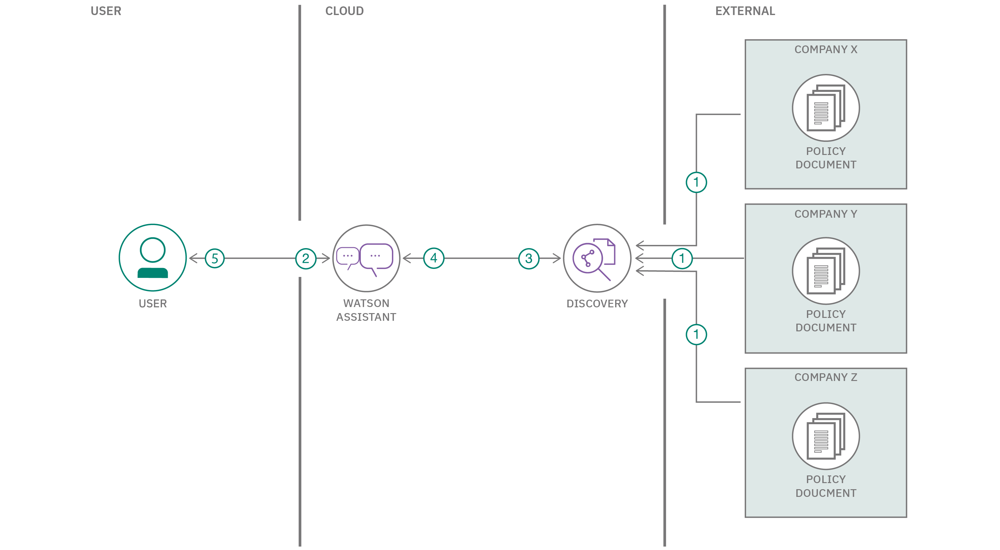
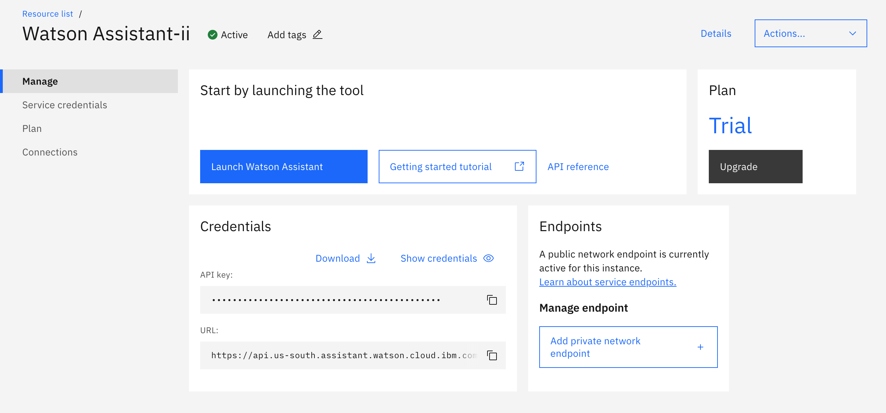
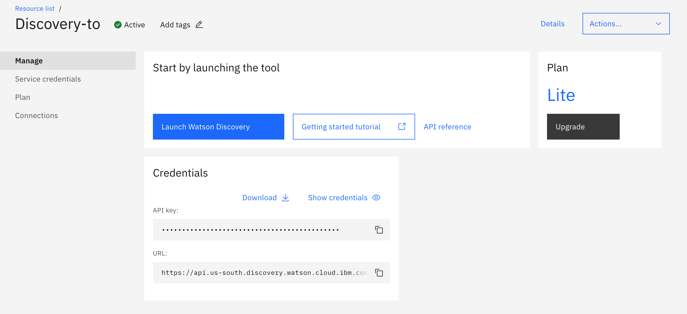
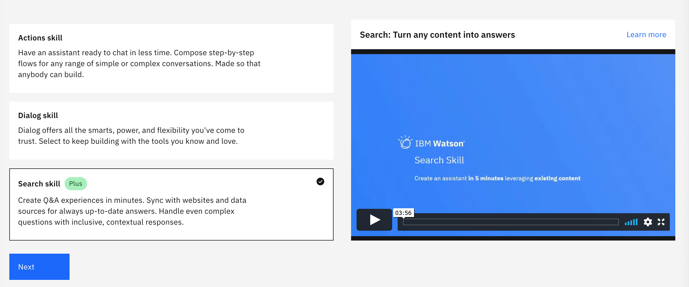
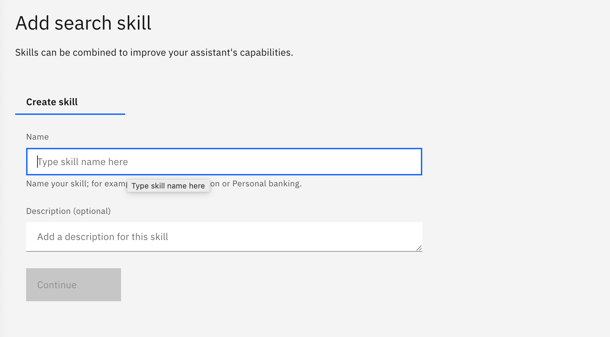
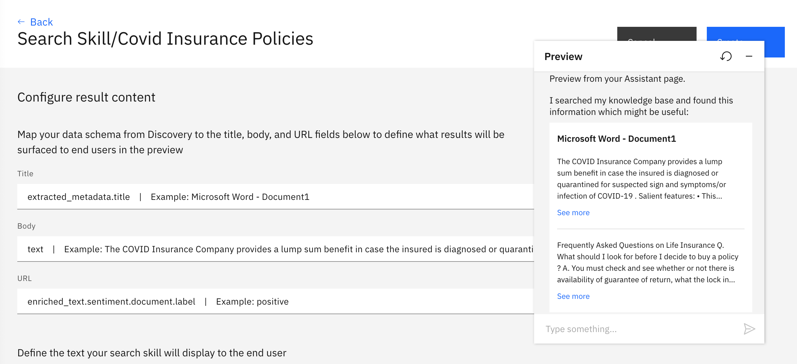
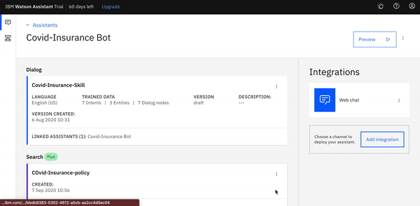
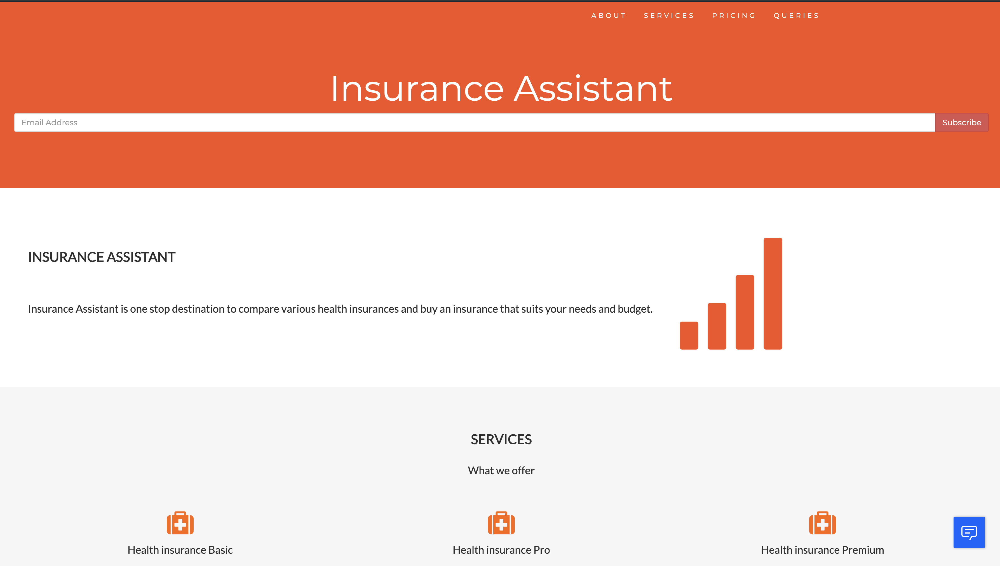
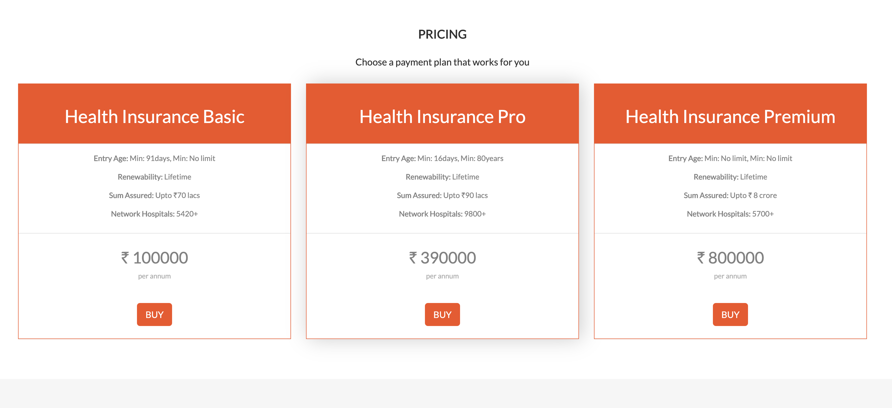

# Build an assistant to evaluate various Health Insurance Policies

This Code Pattern will demonstrate a methodology to build an assistant which can answer queries regarding the Covid Insurance Policies of various companies. And it will also compare the policies and top-up related queries given by them. In Watson Assistant, we will create Dialog skill and using the search skill capability  develop a model in Watson Discovery that will understand the policies and provide an interactive interface to the user. This application will come in handy for various insurance brokers and also a layman who wants to know and compare the policies of various companies.

When user has completed the pattern he will-

* Know how to connect a UI to Watson Assistant and create Dialog Skill. 
* Send sample documents to Watson Discovery answer train custom model. 
* Take personal details from the user using `Context variables` and use them in the Search Query to get personalised results. 
* User will learn how to integrate insights generated with Discovery back to Assistant.



1. Upload Documents on the Watson Discovery-to train the model using SDU on various Policy Documents. 
2. Watson Assistant will interact with the User to take personal details.
3. After collecting personal information, search skill is initiated.
4. The results will be fetched from the Watson Discovery-where the model has been trained on various Policy Documents. 
5. Showcase the results to the user.

## Pre Requisite

* [IBM Cloud Account](http://cloud.ibm.com/)

## Steps
1. [Setup IBM CLOUD account](#1-setup-ibm-cloud-account)
1. [Create Watson Assistant.](#21-create-watson-assistant-service-instance)
   1. [Create Dialog Skill.](#22-create-dialog-skill)
1. [Set up Discovery Service.](#3-setting-up-watson-discovery)
   1. [Create Watson Discovery Service instance](#31--create-watson-discovery-service-instance)
   1. [Create a new Collection. ](#32-create-collection-in-watson-discovery)
1. [Create Search Skill and connect to the Discovery service](#4-create-search-skill-and-connect-to-the-discovery-service)
1. [Copy Integration ID and update to Flask.  ](#5-copy-integration-id-and-update-to-flask)
1. [Run the flask App.](#6-run-the-flask-app)

### 1. Setup `IBM CLOUD` account.
Create an IBM Cloud Account 
- Login to [IBM CLOUD](https://cloud.ibm.com/login)

### 2. Setting up `Watson Assistant`

### 2.1 Create `Watson Assistant` service instance
- Click this [link](https://cloud.ibm.com/catalog/services/watson-assistant) to create Watson assistant service.
- Enter the service name as `Watson Assistant-CovidInsurancebot`. You can choose to enter any name you like.
- Ensure you select the right region, organisation and space.
- Click `Create`.
- Watson Asistant service instance should get created.

### 2.2 Create Dialog Skill 
- Go to IBM Cloud Resource list and click on the Watson Assistant service instance created in above steps.
- On the Watson Assistant Resource list page, click `Launch Watson Assistant`.



- Click `Skills` tab in the side bar.


- Click the `Create skill` button.
- Select the `Dialog skill` box
- Click the `Next` button.
- Select the `Import skill` tab.


- Click on `Choose JSON file`.
- Browse to the cloned repository parent folder -> WA-Skill.
- Select `skill-Covid-Health-Insurance.json` and click `Open`.


### 3. Setting up `Watson Discovery` 
### 3.1  Create `Watson Discovery` Service instance
- Click this [link](https://cloud.ibm.com/catalog/services/discovery) to create Watson Discovery Service.
- Enter the service name as `Watson Discovery-In`. You can choose to enter any name you like.
- Ensure you select the right region, organisation and space.
- Under `Pricing Plans`, select `Lite` plan.
- Click `Create`.
- Watson Discovery service instance should get created.

### 3.2 Create Collection in Watson Discovery

- Click `Launch Watson Discovery` 


- Click `New Collection` and name it as `Covid-Insurance Policies.`


- Click on `Upload Documents` and upload the policy documents in the Data Folder. 


### 4. Create Search Skill and connect to the Discovery service 

- Click `Create Skills` tab in Watson Assistant.

- Select `Search Skill`.



- Give a name in `Add Search Skill` section and click on `Continue`.



- Select the `Discovery Instance` created in the above step(section 3.1). And Choose `Covid-Insurance Policies` collection-created above in section 3.2.

- Click on the `Covid-Discovery-insurance-skill`, you just created and configure the `Display Card`. 



- Click `Assistant` tab in the side bar. Select the Assistant Created and link the Search skill `Covid-Discovery-insurance-skill` with this Assistant.


### 5. Copy integration ID and update to Flask 
- Click `Assistant` tab in the side bar. Select the Assistant Created and link the Search skill `Covid-Discovery-insurance-skill` with this Assistant.

- Click on `Add Integeration ` on the right side and choose Web Chat Integeration. And Click on `Embed`.



* In the repo `template/UI.html`, under line 418, update the copied integration ID within the script tag


### 6. Run the Flask App

* Navigate to cloned repo folder

```
pip install -r requirements.txt
```

* Then run 

``` 
python app.py
```

## Sample Output

* The UI will show you the various Insurance Policies that are offered

  
  
  


* The UI will show you the various Insurance Policies that are offered


  
